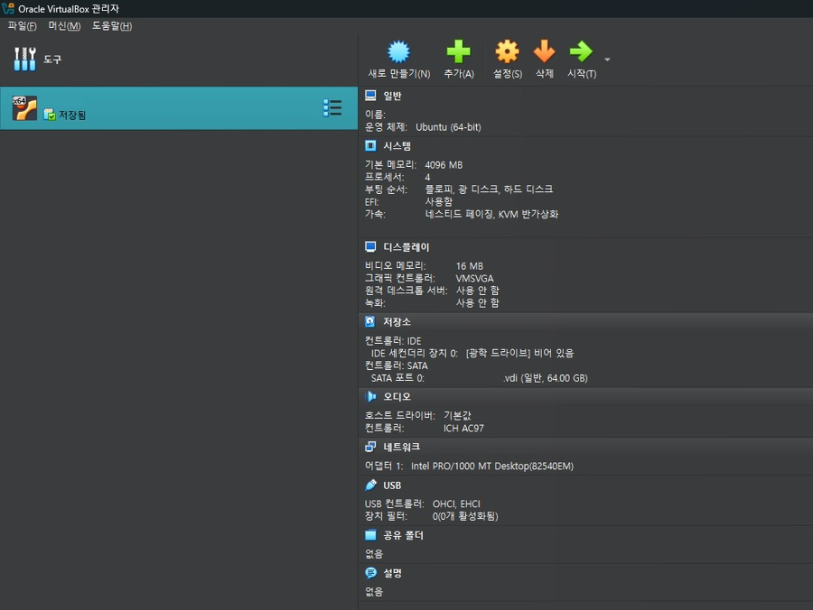

# 1st-Dev-Setup
> 리눅스 개발환경 구성하기

## 🔗 Blog (상세 기록)
- 자세한 과정과 삽질 로그: [<블로그 URL>](https://blog.naver.com/sehn00/223964641072)

## ✅ What I Did (핵심 요약)
- Oracle Virtualbox 설치
- Ubuntu 24.04.3 LTS 설치
- VM 구현

## 🖼️ Result (스크린샷/로그)
- 실행 화면:
  - 
- 로그(발췌):
  ```text

  ...

## 🧰 Environment
- OS/VM: Ubuntu 24.04.1 LTS (VirtualBox)
- Kernel: Linux 6.14.0-27-generic (x86_64)
- Toolchain: gcc (Ubuntu 13.3.0-23ubuntu4) 13.3.0
- Build Tools: make 4.3, git 2.43.0
