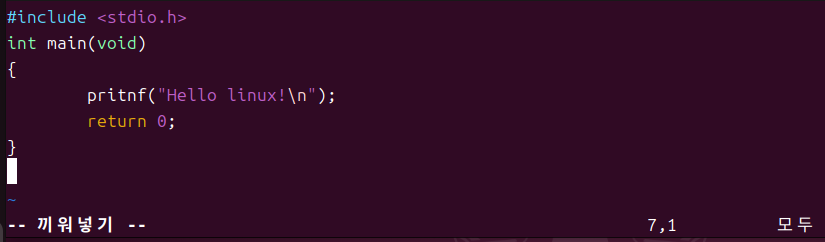

# 3rd-Vim-editor
> Vim Editor 사용법

## 🔗 Blog (상세 기록)
- 자세한 과정과 삽질 로그: [<블로그 URL>](https://blog.naver.com/sehn00/223965351781)

## ✅ What I Did (핵심 요약)
- Vim 설치
- Vim editor 사용법, 단축키 학습

## 🖼️ Result (스크린샷/로그)
실행 화면:




- 로그(발췌):
  ```text

  ...

## 🧰 Environment
- OS/VM: Ubuntu 24.04.1 LTS (VirtualBox)
- Kernel: Linux 6.14.0-27-generic (x86_64)
- Toolchain: gcc (Ubuntu 13.3.0-23ubuntu4) 13.3.0
- Build Tools: make 4.3, git 2.43.0
