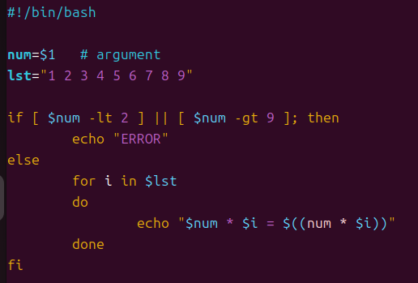
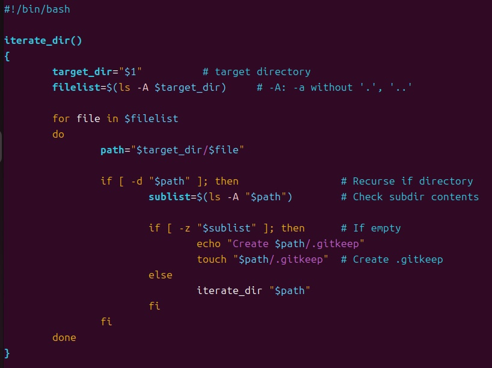
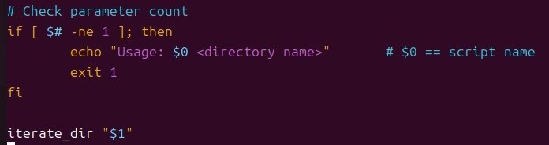
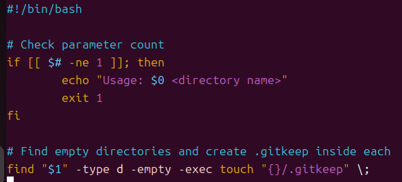

# 4th-Shell-Script
> Shell script

## 🔗 Blog (상세 기록)
- 자세한 과정과 삽질 로그: https://blog.naver.com/sehn00/223967246143

## ✅ What I Did (핵심 요약)
- Shell script 이론
- Shell script 문법
- 실습1: 구구단 출력
- 실습2: .gitkeep 자동화

## 🖼️ Result (스크린샷/로그)
실행 화면:

**구구단 출력**



**.gitkeep 자동화 1**





**.gitkeep 자동화 2**



- 로그(발췌):
  ```text

  ...

## 🧰 Environment
- OS/VM: Ubuntu 24.04.1 LTS (VirtualBox)
- Kernel: Linux 6.14.0-27-generic (x86_64)
- Toolchain: gcc (Ubuntu 13.3.0-23ubuntu4) 13.3.0
- Build Tools: make 4.3, git 2.43.0
