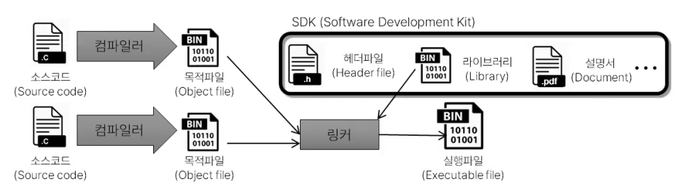
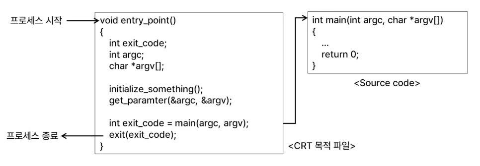
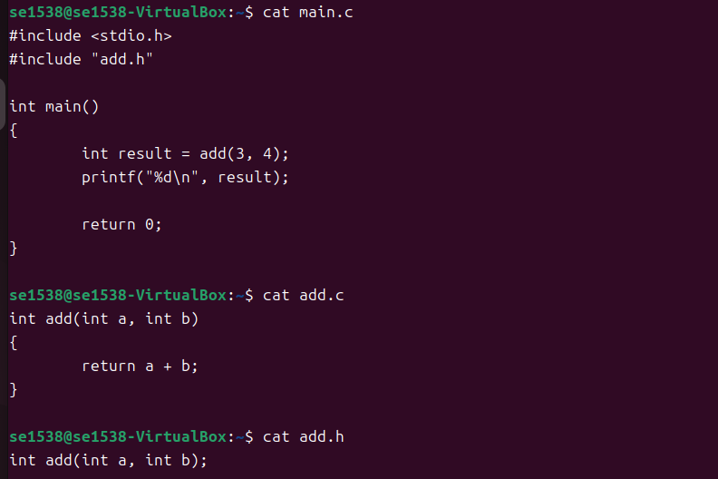
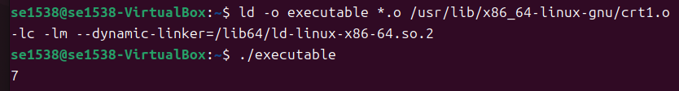

# 1st-Linux-dev-basic
> 리눅스 개발환경 이해

## 🔗 Blog (상세 기록)
- 자세한 과정과 삽질 로그: https://blog.naver.com/sehn00/223972483828

## ✅ What I Did (핵심 요약)
- 빌드 프로세스 이해
- 운영체제 기초 학습
- 컴파일·링킹 이해
- CRT (C Runtime) 개념
- 컴파일·링킹 실습

## 🖼️ Result (스크린샷/로그)
실행 화면:

**빌드 프로세스**



**CRT**



**컴파일·링킹 실습**






- 로그(발췌):
  ```text

  ...

## 🧰 Environment
- OS/VM: Ubuntu 24.04.1 LTS (VirtualBox)
- Kernel: Linux 6.14.0-27-generic (x86_64)
- Toolchain: gcc (Ubuntu 13.3.0-23ubuntu4) 13.3.0
- Build Tools: make 4.3, git 2.43.0


